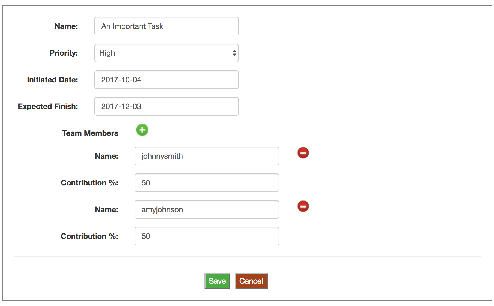

<h1>Confetti - A visual editor for structured data</h1>


Confetti is a Jquery plugin that allows you to create and edit schema-based JSON data structures. It is well-suited for situations where JSON data is used to configure  applications.

Confetti is metadata-driven and uses its schema to generate the UI automatically.  With minimal effort you can create a tool for your users to start creating and editing your application's configuration data.

Suppose you have a task-management application and have a task configuration data structure as seen here:



You can easily create the above form by defining the schema using Confetti's schema DSL as shown below:

__Schema__

```
var task_schema =
{
    class_name: "Task",
    description: "Task Configuration",
    parameters: [
        {
	   name: "name",
	   label: "Name",
	   type: "string",
	   optional: false
	},
        {
	   name: "priority",
	   label: "Priority",
	   type: "priority_enum",
	   optional: false
	},
        {
	   name: "initiated_date",
	   label: "Initiated Date",
	   type: "date",
	   optional: false
	},
        {
	   name: "expected_finish",
	   label: "Expected Finish",
	   type: "date",
	   optional: false
	},
	{
	   name: "team_members",
	   label: "Team Members",
	   type: [
   	      {
	         name: "name",
		 label: "Name",
		 type: "string",
		 optional: false
	      },
   	      {
	         name: "contribution_percentage",
		 label: "Contribution %",
		 type: "integer",
		 optional: false
	      }
	   ],
	   optional: false
	}
    ],
    option_types: [
        {
	   option_name: "priority_enum",
	   multiselect: false,
	   options: [
               { id: "H", label: "High" },
               { id: "M", label: "Medium" },
               { id: "L", label: "Low" }
           ]
	}
    ]
}
```
An example data structure conforming to the above schema definition is shown below:

__Data__

```
var task_data = 
{
  name: "An Important Task",
  priority: "High",
  initiated_date: "2017-10-04",
  expected_finish: "2017-12-03",
  team_members: [
      {
          name: "johnnysmith",
          contribution_percentage: 50
      },
      {
          name: "amyjohnson",
	  contribution_percentage: 50
      }      
  ]
}
```

To create the editor, simply define a div container element and invoke the confetti plugin on it. For example,

```
        $('#container').confetti({ schema: task_schema,
				    instance: task_data,
				    save_callback: process_save,
				    cancel_callback: process_cancel,
				    error_callback: process_error
				 });
```

Note the callback functions passed to the call. For example, the save_callback will be invoked when the user clicks on the Save button.

License
-------
Apache 2 License 2.0 (https://opensource.org/licenses/Apache-2.0)